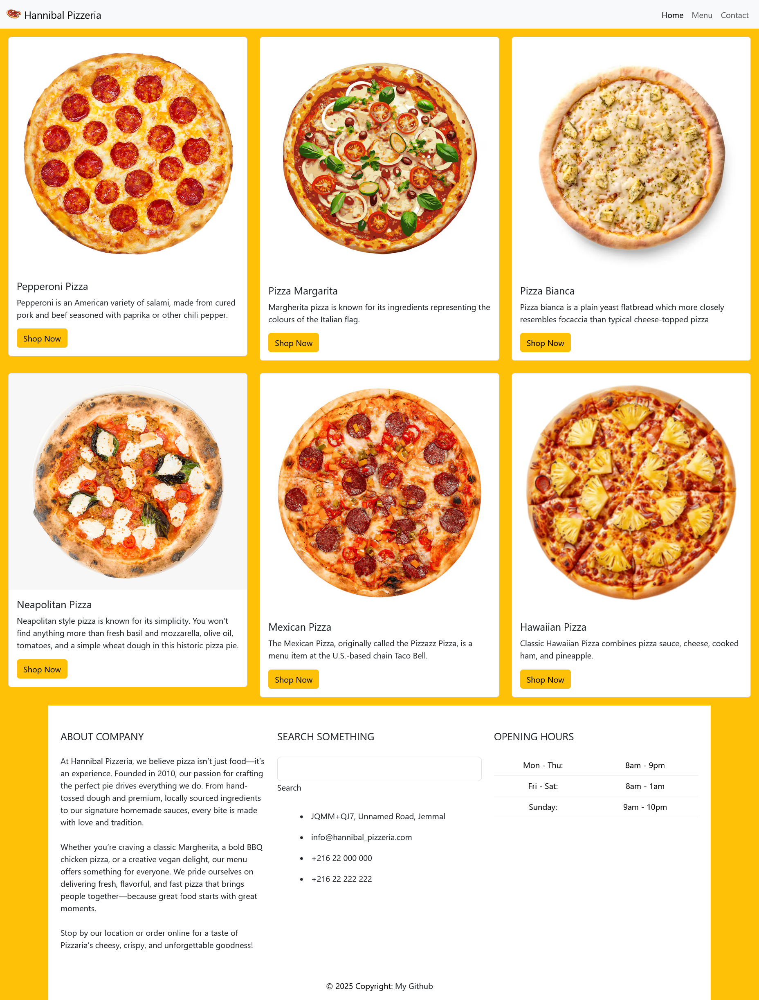

# Store_Landing_Page
# Hannibal Pizzeria 🍕

Welcome to the **Hannibal Pizzeria** landing page!  
A modern, responsive pizza shop website built with Bootstrap 5.

## Features

- 🍕 Beautiful pizza menu cards with images and descriptions
- 🟡 "Shop Now" buttons styled with Bootstrap's warning color
- 📱 Responsive layout for all devices
- 🏢 Informative footer with About, Contact, and Opening Hours
- 🎨 Clean, white footer with black text for clarity

## Live Preview

[Live Preview on GitHub Pages](https://django-unchained-01.github.io/Store_Landing_Page/)

> _If the link above does not work, you can open `index.html` directly in your browser._

## How to Use

1. **Clone or Download** this repository.
2. Open `index.html` in your web browser.
3. Customize content, images, and styles as you wish!

## Screenshots

---

Made with ☕ 